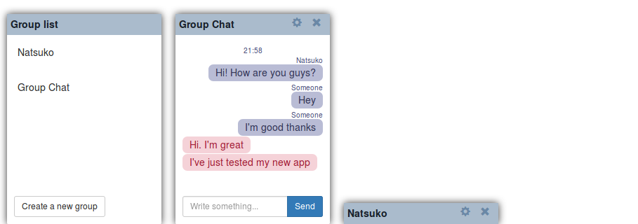

# Simple Chat Web Application

This is a simple chat application using node.js, Vue.js, Socket.IO and MongoDB. It's more a practice project, not production ready yet.

I designed the app as two separate servers: a back-end server which provides a REST API, connecting to a MongoDB database. This communicates to a front-end server, which is built on Vue.js.

### Installation
* Install MongoDB 3.4:
https://www.mongodb.com/
* Clone the project: `git clone https://github.com/Gege251/simplechat`
* Install back-end server dependencies:`cd simplechat/back-end`
  `npm install`
* Install front-end server dependencies:`cd ../front-end`
  `npm install`

### Running
* Run back-end and and front-end in separate terminals:
 * *terminal #1:* `cd simplechat/back-end`
 `npm run dev`
 * *terminal #2:* `cd simplechat/front-end`
 `npm run dev`
